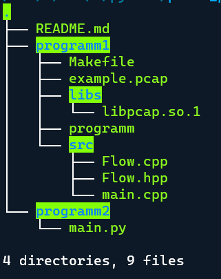

First part (programm1)

steps:

1) cd programm1
2) make build
3) make run pcap_file=example.pcap
   will create output.csv in project root
4) make clean (to remove object file, not executable)
5) cd ..

Second part (programm2)

1. python3 programm2/main.py
   will create output_from_py.csv in project root

Project structure

flow
